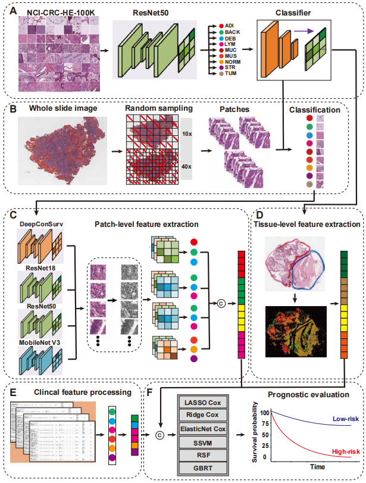

# MSPath-CRC: a multiscale pathology framework integrating patch- and tissue-level features for prognostic prediction in colorectal cancer

This repository implements a complete multiscale deep-learning system for prognostic analysis of colorectal cancer (CRC) using whole-slide images (WSIs).  
The pipeline includes tissue classification, multiscale patch extraction, deep feature generation, spatial tissue structure quantification, cutpoint computation, feature fusion, and survival modeling.

---

## 🔧 Environment

### **Python environment**
- python == 3.11.7  
- pytorch == 2.4.1+cu118  
- openslide-python == 1.3.1  
- numpy == 1.25.2  
- pandas == 2.2.2  
- scikit-learn == 1.2.2  
- scikit-survival (sksurv) == 0.20.0  
- seaborn == 0.13.2  
- opencv-python == 4.10.0  

### **R environment**
- R == 4.4.1  
- survival == 3.8-3  
- survminer == 0.50.0  

---

## 📌 Workflow Overview

The system follows the workflow illustrated in **Figure 1** of the paper, consisting of:

1. **Tissue classification** (ResNet50)
2. **Multiscale patch sampling** (10× & 40×)
3. **Deep feature extraction** (multiple backbones)
4. **Spatial tissue feature computation**
5. **Cutpoint selection** using maximally selected rank statistics
6. **Multi-feature survival prediction**

---
## 📊 Workflow Overview



## 📁 Module Descriptions

### **1. Tissue classification**
#### `resnet50_train.py`
- Trains ResNet50 tissue classifier based on NCT-CRC-HE-100K.
- Outputs tissue map generator used for downstream spatial feature extraction.

---

### **2. Patch sampling**
#### `random_sampling40x.py`
- Extracts patches from WSIs at configurable magnifications (10× / 20× / 40×).
- Generates patch-level datasets for feature extraction.

---

### **3. Patch deep feature extraction**
#### `histopathological_features.py`
- Extracts **128-dimensional** deep features from each WSI.
- Supports multiple backbones:
  - DeepConvSurv  
  - ResNet18  
  - ResNet50  
  - MobileNetV3  
- For each magnification level (10×, 40×), features from all models are averaged.  
- Final histopathological descriptor = **average(10× features, 40× features)** → 128-D vector.

---

### **4. Spatial tissue feature extraction**
#### `segmentation_features40x.py`
- Computes spatial descriptors from tissue maps, including:
  - `max_tumor_area`
  - `lymphocyte_inside_tumor`
  - `lymphocyte_around_tumor`
  - `around_inside_ratio`
  - `total_stromal_area`
  - `max_lym_area`
  - `lymph_tumor_ratio`
  - `max_muc_area`
- Produces WSI-level spatial feature table.

---

### **5. Max-rank cutpoint selection**
#### `segmentation_features_cutpoint.R`
- Uses maximally selected rank statistics to determine optimal cutpoints.
- Converts continuous spatial features into binary prognostic indicators.

---

### **6. Survival modeling**
#### `survival_models.py`
- Fuses:
  - Histopathological features (128-D)
  - Spatial features
  - Clinical features (AGE, STAGE)
- Evaluates multiple survival models:
  - Lasso-Cox
  - Ridge-Cox
  - Elastic Net-Cox
  - SSVM
  - Random Survival Forest
  - Gradient Boosted Survival Analysis
- Outputs C-index of each model and each feature combination.

---

## 🚀 Running the Pipeline

### **① Train the tissue classifier**
```bash
python resnet50_train.py
